

  

<h1 align="center">Jacobo Allemann Castro</h1>
<h3 align="center">Mechatronics Engineer · Robotics · Autonomous Systems · AI · Controls · Industrial Automation · Systems Integration</h3>

  

  <a href="https://github.com/tjallemann01">GitHub</a> ·
  <a href="https://www.linkedin.com/in/jacoboallemanncastro">LinkedIn</a> ·
  <a href="#engineering-systems">Engineering Systems</a> ·
  <a href="#engineering-toolbox">Toolbox</a> ·
  <a href="#professional-practice">Professional Practice</a>

<strong>PERCEIVE → DECIDE → CONTROL → ACTUATE → VALIDATE</strong>

---

## Engineering profile

I am a **Mechatronics Engineer (B.S., Tecnológico de Monterrey, 2026)** focused on building and integrating multidisciplinary systems that connect **mechanics, electronics, embedded computing, machine vision, industrial control, software, actuation, safety, and validation**.

My work is centered on **systems integration**: taking a machine from architecture and subsystem selection through programming, debugging, physical integration, testing, troubleshooting, and technical documentation.

  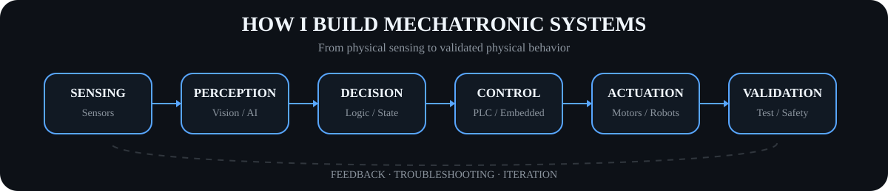

### What I build

| Domain | What it means in my work |
|---|---|
| **Robotics** | Parallel robots, tracked mobile platforms, collaborative robots, motion systems and electromechanical integration |
| **Perception & AI** | YOLO, OpenCV, Intel RealSense, Cognex VisionPro, target tracking and state estimation |
| **Controls** | Siemens PLC / TIA Portal, VESC motor control, PID, embedded control, mode arbitration and safety logic |
| **Embedded systems** | NVIDIA Jetson, STM32, ESP32, UART, I²C, PWM, ADC, watchdogs and real-time coordination |
| **Design & manufacturing** | SolidWorks, Fusion 360, CNC machining, mechanical assembly, PCB integration and robotic laser welding |
| **Validation** | Structured testing, real-environment trials, failsafes, E-STOP/KILL logic, troubleshooting and documentation |

---

## Featured engineering systems

### 01 · Autonomous Mobile Robot + AI

<a href="https://github.com/tjallemann01/AMR-AI-Autonomous-Mobile-Robot">
  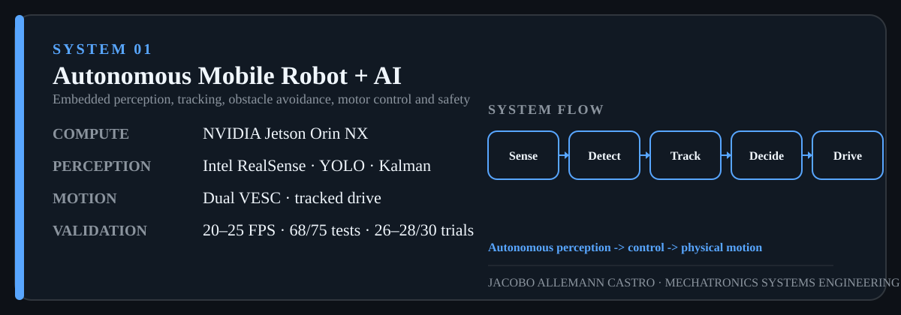
</a>

**Role:** Primary Developer / Systems Integrator  
**Focus:** Autonomous mobility, target tracking, obstacle avoidance, embedded AI, motor actuation, communications, supervision and safety.

**Selected validation evidence:** `20–25 FPS` perception performance · `68 / 75` valid system tests · `26–28 / 30` successful real-environment trials.

<strong>Open the AMR software architecture</strong>

 
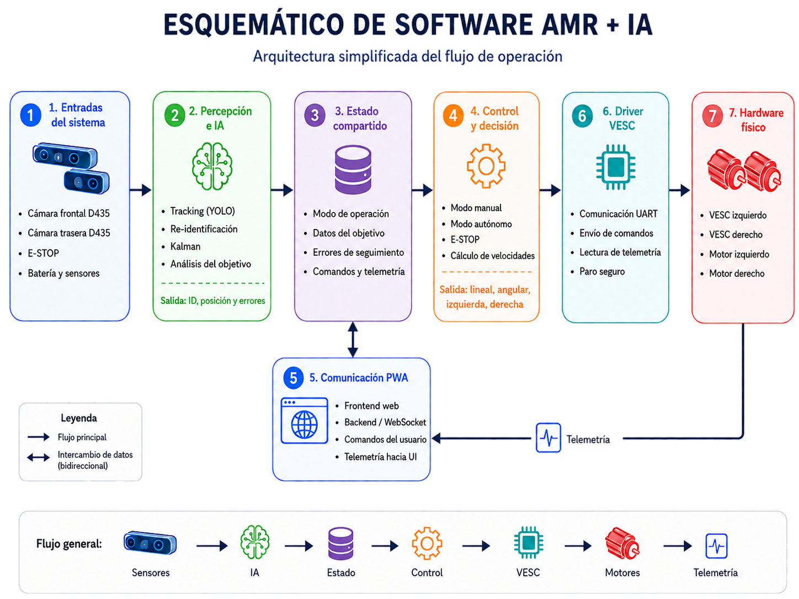

<strong>See the control logic as a native GitHub diagram</strong>

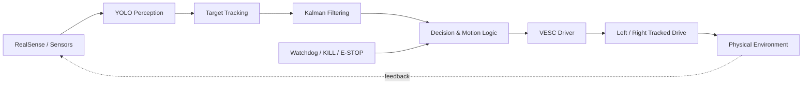

**Repository →** [AMR-AI-Autonomous-Mobile-Robot](https://github.com/tjallemann01/AMR-AI-Autonomous-Mobile-Robot)

---

### 02 · 3-DOF Delta Robot with Computer Vision

<a href="https://github.com/tjallemann01/3DOF-Delta-Robot-Vision-Control">
  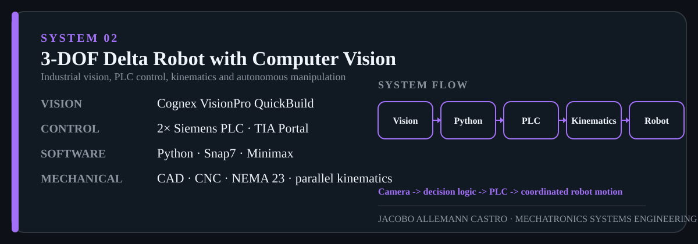
</a>

A complete mechatronic integration combining **parallel-robot mechanics, CNC manufacturing, forward/inverse kinematics, Siemens PLC control, Cognex VisionPro machine vision, Python supervision, industrial communication, pick-and-place routines, and Minimax-based autonomous Tic-Tac-Toe decisions**.

<strong>Open the Delta Robot system flow</strong>

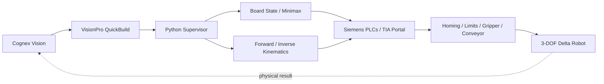

**Repository →** [3DOF-Delta-Robot-Vision-Control](https://github.com/tjallemann01/3DOF-Delta-Robot-Vision-Control)

---

### 03 · BattleBot P_5

<a href="https://github.com/tjallemann01/BattleBot">
  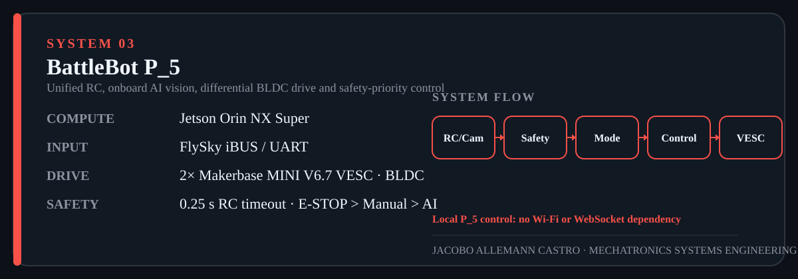
</a>

The P_5 software stack unifies **FlySky iBUS RC input, Jetson-based onboard vision, YOLO target detection, differential left/right motor control, dual Makerbase MINI V6.7 VESCs, simulation/dry-run modes and explicit safety-priority logic**.

> **Control priority:** `E-STOP > Manual > AI`

The final hardware architecture intentionally separates the **36 V propulsion domain** from the **24 V → buck → ~19 V Jetson compute domain**. P_5 performs local control and does **not** depend on Wi-Fi, WebSocket, PWA, MQTT, Flask or cloud control.

<strong>Open the BattleBot hardware architecture</strong>

 
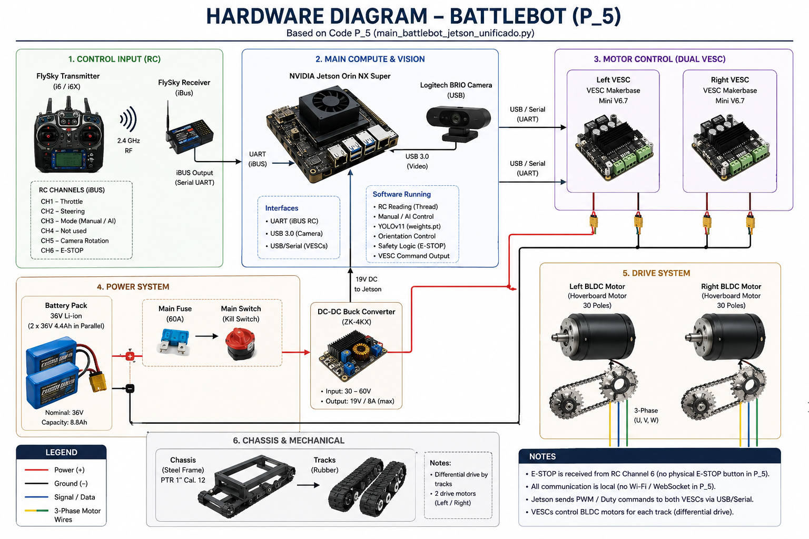

<strong>Open the P_5 control priority</strong>

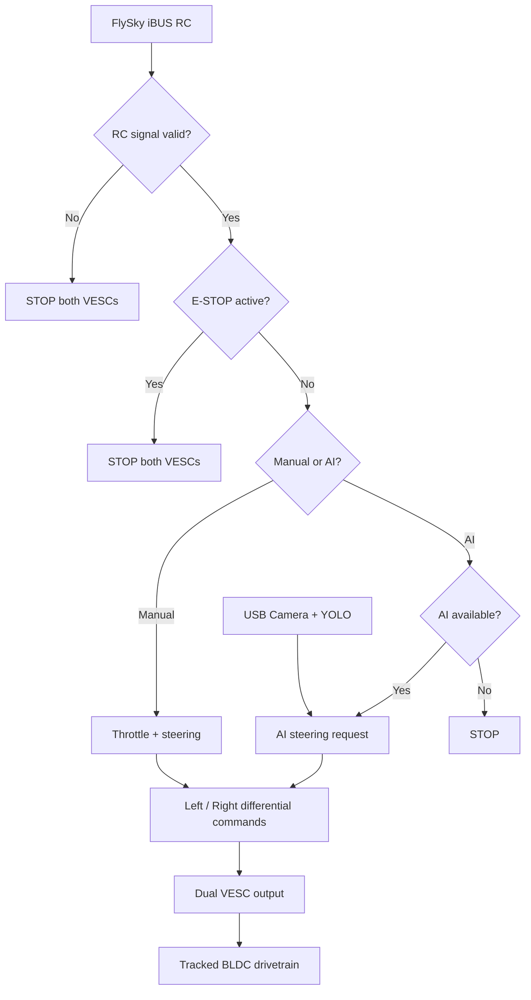

**Repository →** [BattleBot](https://github.com/tjallemann01/BattleBot)

---

### 04 · Industrial Drying-Line Automation

<a href="https://github.com/tjallemann01/Industrial-Drying-Line-Automation">
  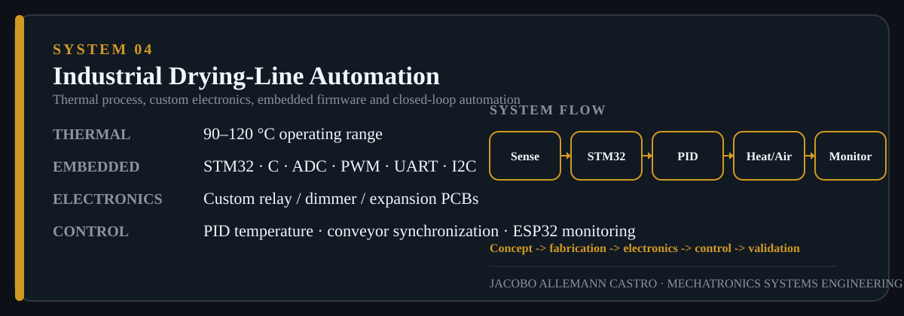
</a>

End-to-end process automation covering **mechanical fabrication, thermal design, SolidWorks thermal/airflow analysis, custom electronics and PCBs, STM32 firmware, PID temperature control, conveyor synchronization, ESP32 monitoring, integration and validation**.

<strong>Open the process-control architecture</strong>

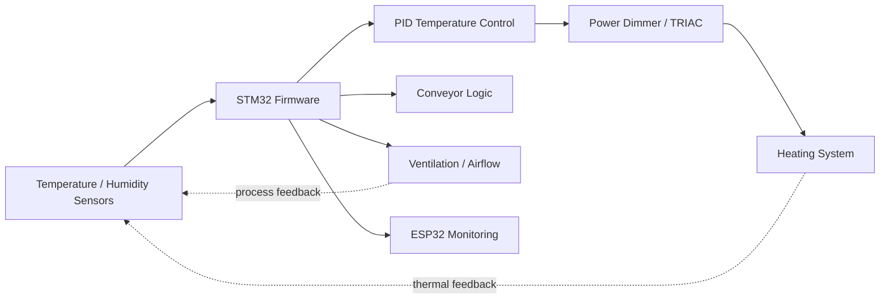

**Repository →** [Industrial-Drying-Line-Automation](https://github.com/tjallemann01/Industrial-Drying-Line-Automation)

---

## Professional practice

### Robotic Laser-Welding System Integration · G.A. Systems, Inc.

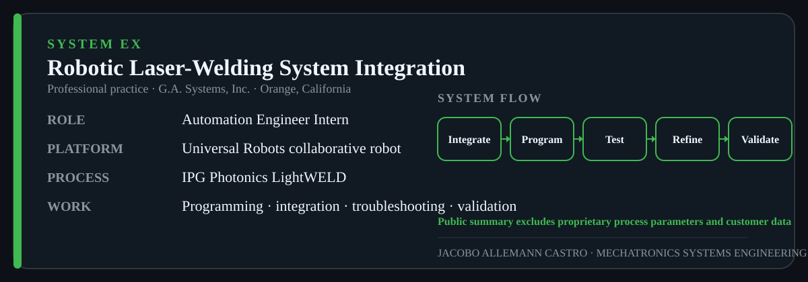

**Automation Engineer Intern · Nov 2025 – Feb 2026 · Orange, California**

Worked on automated laser-welding cells using **Universal Robots collaborative robots** and **IPG Photonics LightWELD**, integrating robotic motion, process activation, tooling and manufacturing requirements. Activities included robotic work-cell setup, programming and adjustment of test trajectories, approach/retreat behavior, troubleshooting, functional testing, validation, repeatability improvement and technical documentation.

**Engineering workflow:** `INTEGRATE -> CONFIGURE -> PROGRAM -> TEST -> TROUBLESHOOT -> VALIDATE`

> Public portfolio material intentionally excludes proprietary welding parameters, customer information and confidential production documentation.

---

## Engineering toolbox

<table>
<tr>
<td valign="top" width="33%">

### Perception & AI
- Python
- YOLO
- OpenCV
- Intel RealSense
- Cognex VisionPro
- Kalman filtering
- Target detection / tracking

</td>
<td valign="top" width="33%">

### Control & Embedded
- Siemens PLC / TIA Portal
- NVIDIA Jetson Orin NX
- STM32 / C
- ESP32
- VESC motor control
- PID control
- Watchdog / E-STOP logic

</td>
<td valign="top" width="33%">

### Mechanical & Manufacturing
- SolidWorks
- Fusion 360
- CNC milling / turning
- Mechanical assembly
- PCB integration
- Universal Robots
- IPG LightWELD

</td>
</tr>
</table>

### Interfaces & system integration

`UART` · `iBUS` · `USB` · `Snap7` · `GET/PUT` · `WebSocket` · `I²C` · `PWM` · `ADC` · `Industrial I/O`

---

## Engineering decisions I care about

| Problem | Design response |
|---|---|
| Autonomous and manual commands can conflict | Explicit operating-mode arbitration and safety priority |
| RC or sensor input can disappear | Failsafe stop states, watchdog behavior and validation before actuation |
| High-current propulsion can disturb onboard computing | Separate compute and propulsion power domains where appropriate |
| Vision alone does not move a machine | Close the chain from perception → decision → control → actuation |
| Multidisciplinary prototypes can hide integration faults | Test by subsystem, dry-run where possible, then validate end-to-end |
| Industrial systems must be reproducible | Document setup, interfaces, operating logic and validation evidence |

---

## Live engineering activity

  
  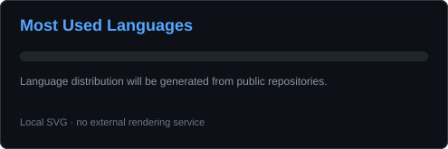

  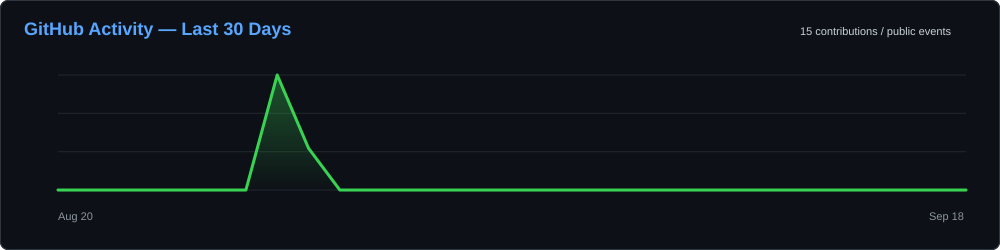

### Contribution system — animated

  <picture>
    <source media="(prefers-color-scheme: dark)" srcset="https://raw.githubusercontent.com/tjallemann01/tjallemann01/output/github-contribution-grid-snake-dark.svg">
    <source media="(prefers-color-scheme: light)" srcset="https://raw.githubusercontent.com/tjallemann01/tjallemann01/output/github-contribution-grid-snake.svg">
    
  </picture>

The contribution animation is generated automatically by GitHub Actions and updates daily.

### Recent public GitHub activity

<!--START_SECTION:activity-->
_This section will populate automatically after the Recent GitHub Activity workflow runs._
<!--END_SECTION:activity-->

---

## Explore the repositories

| System | Repository | Core engineering areas |
|---|---|---|
| **AMR + AI** | [Open repository](https://github.com/tjallemann01/AMR-AI-Autonomous-Mobile-Robot) | Embedded AI · computer vision · tracking · obstacle avoidance · VESC · safety |
| **3-DOF Delta Robot** | [Open repository](https://github.com/tjallemann01/3DOF-Delta-Robot-Vision-Control) | PLC · machine vision · kinematics · Python · CNC · autonomous manipulation |
| **BattleBot P_5** | [Open repository](https://github.com/tjallemann01/BattleBot) | Jetson · RC/iBUS · YOLO · dual VESC · BLDC · safety-priority control |
| **Industrial Drying Line** | [Open repository](https://github.com/tjallemann01/Industrial-Drying-Line-Automation) | STM32 · PID · PCBs · thermal systems · ESP32 · process automation |

---

  <strong>From sensing and intelligence to control and physical motion.</strong> 
  Mechatronics · Robotics · Automation · Systems Integration

