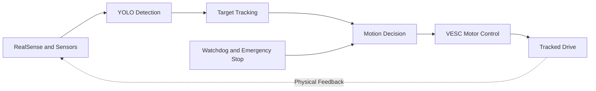
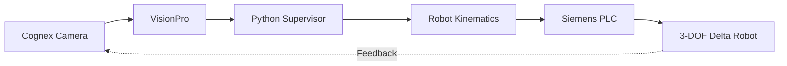
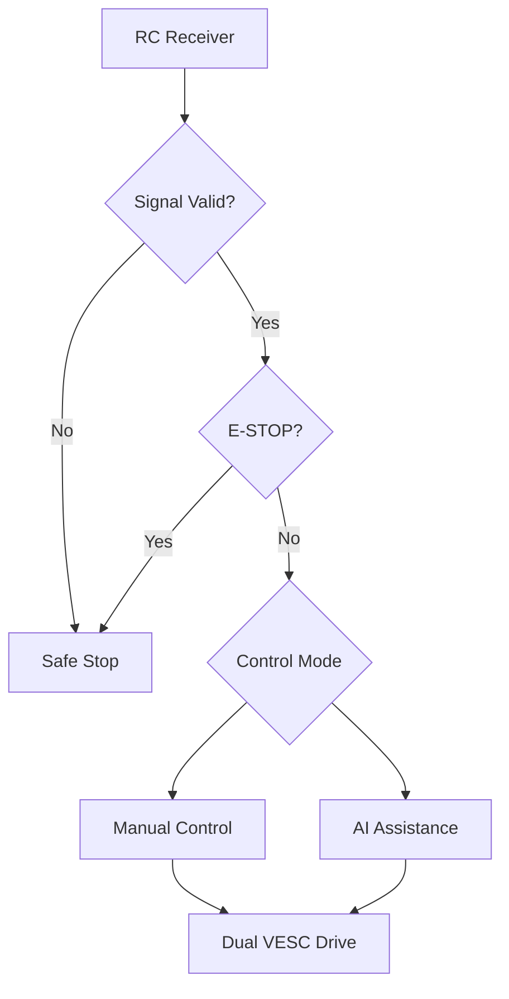
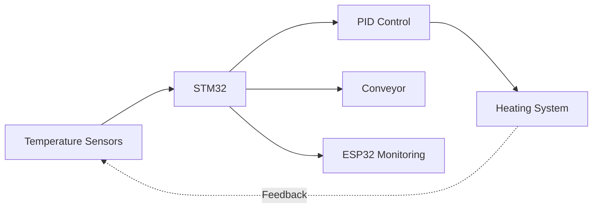

  

<h1 align="center">Jacobo Allemann Castro</h1>
<h3 align="center">Mechatronics Engineer · Robotics · Artificial Intelligence · Automation · Systems Integration</h3>

  
  
  

<strong>PERCEIVE → DECIDE → CONTROL → ACTUATE → VALIDATE</strong>

  <a href="#engineering-profile">Profile</a> · <a href="#featured-engineering-systems">Engineering Systems</a> · <a href="#harvard-cs50ai--12-completed-projects">Harvard AI</a> · <a href="#technical-toolbox">Toolbox</a> · <a href="#education--professional-practice">Education & Practice</a>

---

## Engineering Profile

**B.S. in Mechatronics Engineering — Tecnológico de Monterrey (2026).** I design, build and integrate intelligent electromechanical systems connecting **mechanical design, sensing, computer vision, embedded computing, control, actuators, safety and testing**.

My work emphasizes the entire engineering cycle—from subsystem selection and CAD to implementation, troubleshooting and physical validation.

| Discipline | Engineering focus |
| :-- | :-- |
| **Autonomous Systems** | Mobile robotics, perception, tracking, motion control and safety supervision |
| **Intelligent Perception** | YOLO, OpenCV, Intel RealSense and Cognex VisionPro |
| **Embedded Control** | NVIDIA Jetson, STM32, ESP32, sensors, BLDC/VESC and PID |
| **Industrial Robotics** | Siemens PLC/TIA Portal, robotic kinematics, manufacturing and systems integration |
| **Design & Validation** | SolidWorks, prototyping, integration testing, troubleshooting and documentation |

---

## Featured Engineering Systems

### 01 — Autonomous Mobile Robot + AI

**Role:** Primary Developer / Systems Integrator. NVIDIA Jetson Orin NX, Intel RealSense, YOLO perception, target tracking, VESC motor control and safety supervision.

**Documented observations:** approximately 20–25 FPS in perception tests; 68/75 valid system tests; 26–28/30 successful real-environment trials under the reported test conditions.

<strong>View perception-to-motion architecture</strong>

```mermaid
flowchart LR
    A[RealSense and Sensors] --> B[YOLO Detection]
    B --> C[Target Tracking]
    C --> D[Motion Decision]
    D --> E[VESC Motor Control]
    E --> F[Tracked Drive]
    F -. Physical Feedback .-> A
    G[Watchdog and Emergency Stop] --> D
```

**[Explore AMR project →](https://github.com/tjallemann01/AMR-AI-Autonomous-Mobile-Robot)**

### 02 — 3-DOF Delta Robot with Computer Vision

Parallel robotic mechanisms, Siemens PLC/TIA Portal, Cognex VisionPro, Python integration, forward/inverse kinematics and vision-guided manipulation.

<strong>View robot system flow</strong>

```mermaid
flowchart LR
    CAM[Cognex Camera] --> VP[VisionPro]
    VP --> PY[Python Supervisor]
    PY --> KIN[Robot Kinematics]
    KIN --> PLC[Siemens PLC]
    PLC --> ROBOT[3-DOF Delta Robot]
    ROBOT -. Feedback .-> CAM
```

**[Explore Delta Robot →](https://github.com/tjallemann01/3DOF-Delta-Robot-Vision-Control)**

### 03 — BattleBot P_5

FlySky iBUS RC, onboard NVIDIA Jetson vision, YOLO target detection, differential BLDC drive, dual Makerbase MINI VESC controllers and safety-oriented mode arbitration.

**Control priority:** `E-STOP > MANUAL > AI`

<strong>View control-priority logic</strong>

```mermaid
flowchart TD
    INPUT[RC Receiver] --> VALID{Signal Valid?}
    VALID -- No --> STOP[Safe Stop]
    VALID -- Yes --> ESTOP{E-STOP?}
    ESTOP -- Yes --> STOP
    ESTOP -- No --> MODE{Control Mode}
    MODE --> MAN[Manual Control]
    MODE --> AI[AI Assistance]
    MAN --> DRIVE[Dual VESC Drive]
    AI --> DRIVE
```

**[Explore BattleBot →](https://github.com/tjallemann01/BattleBot)**

### 04 — Industrial Drying-Line Automation

Thermal and airflow design, STM32 firmware, temperature control, conveyor synchronization, custom electronics and ESP32 monitoring.

<strong>View process-control architecture</strong>

```mermaid
flowchart LR
    SENSOR[Temperature Sensors] --> MCU[STM32]
    MCU --> PID[PID Control]
    PID --> HEATER[Heating System]
    MCU --> CONVEYOR[Conveyor]
    MCU --> ESP[ESP32 Monitoring]
    HEATER -. Feedback .-> SENSOR
```

**[Explore Drying-Line Automation →](https://github.com/tjallemann01/Industrial-Drying-Line-Automation)**

---

## Harvard CS50AI — 12 Completed Projects

**CS50's Introduction to Artificial Intelligence with Python.** Projects span fundamental search algorithms through probabilistic inference, machine learning, reinforcement learning, computer vision and Transformer-based NLP.

| Project | AI topic | Repository |
| :-- | :-- | :-- |
| Degrees | Breadth-first search | [CS50AI-Degrees](https://github.com/tjallemann01/CS50AI-Degrees) |
| Tic-Tac-Toe | Minimax, adversarial search | [CS50AI-TicTacToe](https://github.com/tjallemann01/CS50AI-TicTacToe) |
| Knights | Propositional logic, model checking | [CS50AI-Knights](https://github.com/tjallemann01/CS50AI-Knights) |
| Minesweeper | Knowledge-based agents | [CS50AI-Minesweeper](https://github.com/tjallemann01/CS50AI-Minesweeper) |
| PageRank | Probabilistic ranking | [CS50AI-PageRank](https://github.com/tjallemann01/CS50AI-PageRank) |
| Heredity | Bayesian inference | [CS50AI-Heredity](https://github.com/tjallemann01/CS50AI-Heredity) |
| Crossword | Constraint satisfaction | [CS50AI-Crossword](https://github.com/tjallemann01/CS50AI-Crossword) |
| Shopping | Supervised learning, KNN | [CS50AI-Shopping](https://github.com/tjallemann01/CS50AI-Shopping) |
| Nim | Reinforcement learning, Q-learning | [CS50AI-Nim](https://github.com/tjallemann01/CS50AI-Nim) |
| Traffic | CNN, TensorFlow, computer vision | [CS50AI-Traffic](https://github.com/tjallemann01/CS50AI-Traffic) |
| Parser | Natural language parsing, NLTK | [CS50AI-Parser](https://github.com/tjallemann01/CS50AI-Parser) |
| Attention | BERT, Transformer self-attention | [CS50AI-Attention](https://github.com/tjallemann01/CS50AI-Attention) |

> **Academic integrity:** Repositories containing graded CS50AI solutions should remain private under course sharing restrictions. Links to private repositories are visible only to authorized viewers.

---

## Technical Toolbox

| AI & Perception | Control & Embedded | Mechanical & Industrial |
| :-- | :-- | :-- |
| Python / TensorFlow | NVIDIA Jetson | SolidWorks / CAD |
| YOLO / OpenCV | STM32 / ESP32 | Siemens PLC / TIA Portal |
| RealSense / Cognex | VESC / BLDC motors | Robot kinematics |
| BERT / NLTK | PID / Watchdogs | CNC / Prototyping |
| Tracking / Kalman filtering | UART / I²C / PWM | Integration & Validation |

---

## Education & Professional Practice

- **B.S. Mechatronics Engineering — Tecnológico de Monterrey (2026).**
- **Harvard CS50AI — completed coursework and twelve programming projects.** [Verify certificate](https://cs50.harvard.edu/certificates/4d1848b5-b7cc-4b37-8155-819e19e6054d).
- **Lean Six Sigma Black Belt coursework** — organizational development, team management and process-improvement methodology.
- **AI development coursework** — Model Context Protocol (MCP), AI agents, subagents and developer tooling.

### Robotics & Industrial Automation Practice

**G.A. Systems, Inc.** — Industrial equipment and robotic automation experience involving robot programming, technical integration, manufacturing and functional testing. Proprietary details are intentionally omitted.

---

## Design Philosophy

> **Build systems that can perceive, reason, act safely and be tested in the physical world.**

I prioritize controlled experimentation, technical documentation, safety interlocks, measurable validation and responsible engineering practice.

<strong>Explore the work. Understand the system. Build what comes next.</strong>

