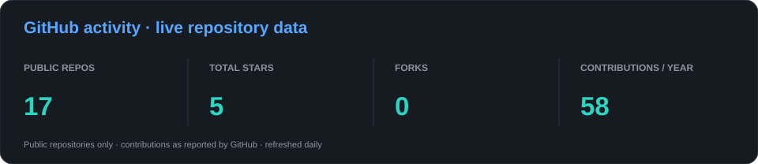
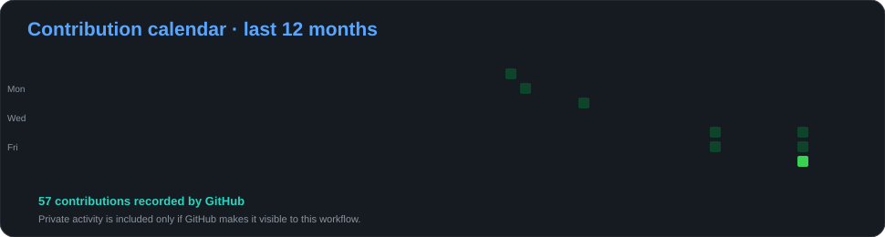
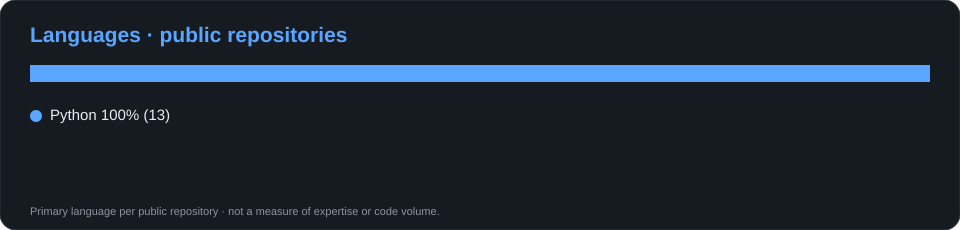

<div align="center">



### Mechatronics Engineer · Robotics & Autonomous Systems · Applied Artificial Intelligence

**From mechanical design and embedded electronics to computer vision and autonomous intelligence.**

[](https://github.com/tjallemann01)
[](https://cs50.harvard.edu/certificates/4d1848b5-b7cc-4b37-8155-819e19e6054d)
[](https://github.com/tjallemann01?tab=repositories)

</div>

---

## About me

I'm **Jacobo Allemann Castro**, a **Mechatronics Engineering graduate from Tecnológico de Monterrey** with hands-on experience building intelligent systems that connect **mechanics, electronics, control, software, and AI**.

My work spans autonomous mobile robots, computer vision, motion control, electromechanical design, and applied machine learning. I enjoy turning engineering prototypes into reliable systems, documenting results, and continuously improving through measurement and experimentation.

- **Engineering:** mechanical design, CAD, prototyping, sensors and actuators, control systems.
- **AI & software:** Python, object detection and tracking, TensorFlow, transformers, algorithmic problem-solving.
- **Systems:** NVIDIA Jetson, embedded computing, motor controllers, and hardware–software integration.
- **Quality:** Lean Six Sigma Black Belt coursework and process-improvement methodologies.
- **Languages:** English and Spanish.

## Featured engineering projects

| Project | Engineering focus | Repository |
|:--|:--|:--|
| **AMR + AI — Autonomous Mobile Robot** | Real-time person tracking, obstacle awareness, NVIDIA Jetson, Intel RealSense, motor control | [Explore project](https://github.com/tjallemann01/AMR-AI) |
| **3-DOF Delta Robot — Vision Control** | Parallel robot mechanisms, CAD, machine vision, automation and control | [View repositories](https://github.com/tjallemann01?tab=repositories&q=Delta) |
| **BattleBot / Embedded Robotics** | Mechatronic integration, mechanisms, electronics and embedded systems | [View repositories](https://github.com/tjallemann01?tab=repositories&q=Battle) |

### Applied robotics highlights

```text
Sensors / Cameras
       |
       v
Perception & Tracking  -->  Decision Logic  -->  Motor Control
       ^                                          |
       |                                          v
       +------------ Feedback & Safety -------- Robot
```

> **Engineering perspective:** Useful AI becomes more valuable when it works reliably with physical sensors, actuators, safety constraints, and measurable performance.

## Harvard CS50AI — 12 completed projects

I completed **Harvard CS50's Introduction to Artificial Intelligence with Python** and its 12 programming projects, covering search, reasoning, probability, optimization, machine learning, computer vision, reinforcement learning, and natural language processing.

**[Verify Harvard CS50AI certificate](https://cs50.harvard.edu/certificates/4d1848b5-b7cc-4b37-8155-819e19e6054d)**

| Project | Core concepts | Repository |
|:--|:--|:--|
| Degrees | Breadth-first search, graph traversal | [CS50AI-Degrees](https://github.com/tjallemann01/CS50AI-Degrees) |
| Tic-Tac-Toe | Minimax, game theory | [CS50AI-TicTacToe](https://github.com/tjallemann01/CS50AI-TicTacToe) |
| Knights | Propositional logic, knowledge bases | [CS50AI-Knights](https://github.com/tjallemann01/CS50AI-Knights) |
| Minesweeper | Logical inference, intelligent agents | [CS50AI-Minesweeper](https://github.com/tjallemann01/CS50AI-Minesweeper) |
| PageRank | Markov chains, probability, sampling | [CS50AI-PageRank](https://github.com/tjallemann01/CS50AI-PageRank) |
| Heredity | Bayesian inference, joint probability | [CS50AI-Heredity](https://github.com/tjallemann01/CS50AI-Heredity) |
| Crossword | Constraint satisfaction, backtracking | [CS50AI-Crossword](https://github.com/tjallemann01/CS50AI-Crossword) |
| Shopping | Classification, k-nearest neighbors | [CS50AI-Shopping](https://github.com/tjallemann01/CS50AI-Shopping) |
| Nim | Q-learning, reinforcement learning | [CS50AI-Nim](https://github.com/tjallemann01/CS50AI-Nim) |
| Traffic | Neural networks, image classification | [CS50AI-Traffic](https://github.com/tjallemann01/CS50AI-Traffic) |
| Parser | Context-free grammars, NLP | [CS50AI-Parser](https://github.com/tjallemann01/CS50AI-Parser) |
| Attention | BERT, transformers, self-attention | [CS50AI-Attention](https://github.com/tjallemann01/CS50AI-Attention) |

*Note: Some course assignment repositories are private to respect academic-integrity guidelines. Their links may not be accessible to other visitors.*

## Tools & technologies

<div align="center">


</div>

## Live GitHub dashboard

These graphics are **generated from GitHub's API** and **stored in this repository**. A GitHub Actions workflow refreshes them daily and can also be run manually. They do not depend on third-party statistics-image servers.

<div align="center">







</div>

**How to read these charts:** repository and language figures count public, non-fork repositories; the contribution calendar reflects contributions made available to the workflow by GitHub. Private repositories and private contributions may be omitted. The language chart counts each repository's primary language, **not** lines of code or proficiency.

> Updates run on a daily schedule (and on demand); GitHub may delay scheduled workflows or disable them after prolonged repository inactivity. See **Actions → Update GitHub profile graphics** to run it manually. GitHub may cache SVGs temporarily.

---

<div align="center">

### Building the next generation of intelligent machines

*Robotics · AI · Autonomous Systems · Mechatronics · Continuous Improvement*

[Explore my repositories](https://github.com/tjallemann01?tab=repositories) · [Verify my Harvard certificate](https://cs50.harvard.edu/certificates/4d1848b5-b7cc-4b37-8155-819e19e6054d)

</div>
